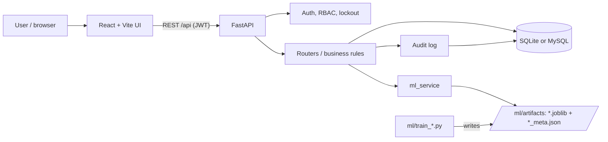
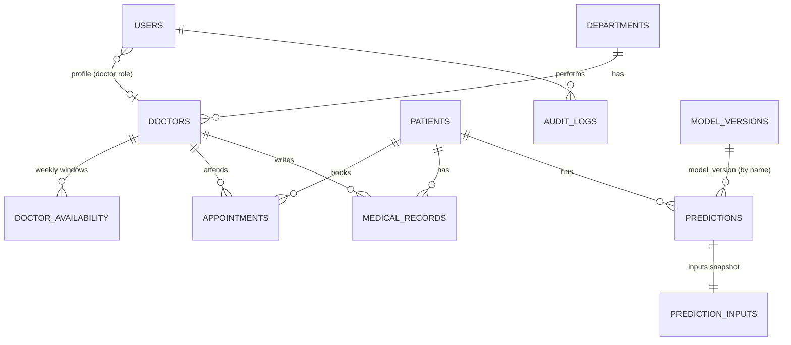

# Architecture

* **Frontend** (`frontend/`): React 18, React Router, Recharts. The UI hides pages the role cannot use, but the API
  is the real authority: every route is guarded by `require_roles(...)`.
* **API** (`backend/app/`): FastAPI + SQLAlchemy 2. One router per module (`routers/`), pydantic schemas for all
  input validation, a global handler that never echoes submitted values or stack traces.
* **ML** (`ml/`): training is offline and separate from serving. `ml/common.py` compares Logistic Regression,
  Decision Tree, Random Forest and (if installed) XGBoost with 5-fold CV, selects by CV ROC-AUC, and writes a
  versioned artifact. The API only loads artifacts (`backend/app/ml_service.py`), registers them in
  `model_versions`, and stores every prediction with the model version that produced it.
* **Database**: created automatically on start (`Base.metadata.create_all`). There are no migrations yet —
  adding a column to an existing table needs a manual `ALTER` or a fresh DB.

## Data model

`login_throttle` (failed-login counter per email) is intentionally not linked to `users`.

## Key design decisions

| Decision | Why |
|---|---|
| Appointment `slot_key` is `"active"` while a booking holds a slot and `NULL` once cancelled/completed, with a unique constraint on (doctor, date, time, slot_key) | Prevents double-booking at the database level (also under concurrent requests) while letting a cancelled slot be re-booked. NULLs are distinct in both SQLite and MySQL unique indexes. |
| Doctor schedules are optional: no windows = unrestricted | Keeps the system usable before an admin has entered schedules; when windows exist, bookings must be on the 30-minute grid inside them. |
| Lockout counter is keyed by email, not by user row | Unknown emails lock out the same way as real ones, so lockout can't be used to discover which emails are registered. |
| Audit entries store IDs and changed field *names* only | Keeps PHI out of the audit trail. |
| Explanations = "swap one feature for the training median, measure the change in risk" | Works for every model type with no extra dependency. It is a local sensitivity measure, not SHAP; interactions between features are not attributed. |
| Dashboard and model metrics expose aggregates only | Lets analysts see activity without access to patient records. Analyst CSV export uses patient IDs, never names. |
